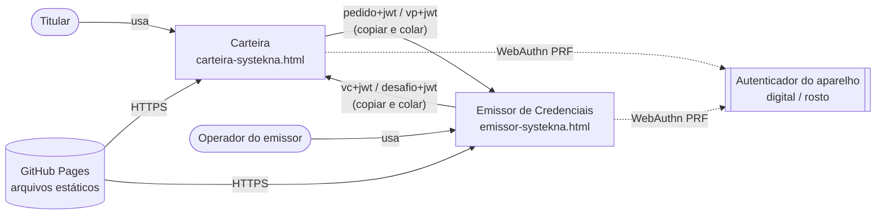
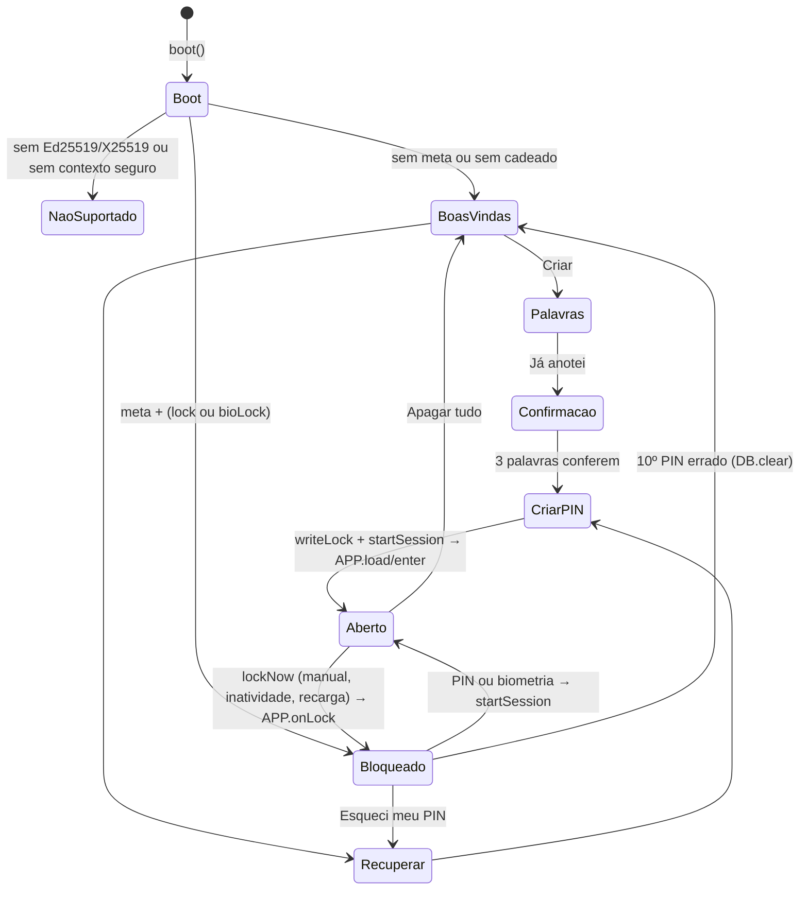
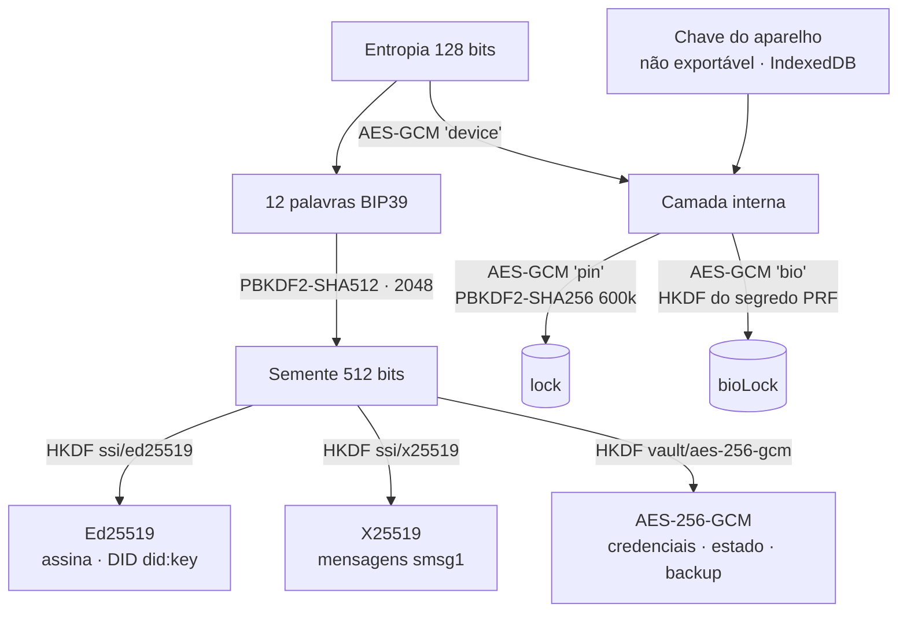
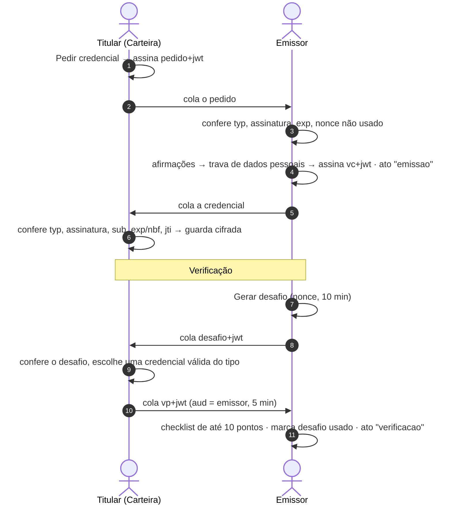
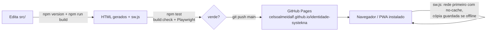

# 01 · Arquitetura

> Seção 2 = arquitetura **atual** (0.13.0). Seção 3 = arquitetura **alvo** (3 aplicativos). Seção 4 = como sair de uma para a outra.
> O modelo de ameaças do PIN, que estava no documento original `identidade-soberana-systekna-arquitetura.md`, foi trazido para a seção 2.9.

## 1. Princípios

| # | Princípio | Atual | Alvo | Consequência no desenho |
|---|---|---|---|---|
| P1 | **Soberania** | ✅ | ⬜ | A identidade nasce no aparelho do titular. Ninguém guarda nem recupera as 12 palavras |
| P2 | **Minimização** | 🟡 | ⬜ ❓DP-03 | Hoje a credencial leva `nome`; o alvo quer só o DID trafegando |
| P3 | **Verificação local** | ✅ | ⬜ | A chave pública vem dentro do DID (`did:key`). Ninguém consulta servidor para verificar |
| P4 | **Posse comprovada** | ✅ | ⬜ | Todo uso exige assinar um desafio novo, de uso único |
| P5 | **Validade curta** | 🟡 | ⬜ ❓DP-02 | Hoje há validade **e** revogação local; o alvo usa só validade |
| P6 | **Recuperável pelo dono** | ✅ | ⬜ | Cada app recria a própria identidade com 12 palavras |
| P7 | **Apps independentes** | ✅ | ⬜ | Os apps não compartilham armazenamento: só trocam texto assinado |
| P8 | **Zero dependência** | ✅ | ⬜ | Cada app é um HTML único que roda no navegador, sem nada carregado de fora |

## 2. Arquitetura atual (0.13.0)

### 2.1 Visão geral

Dois **serviços estáticos independentes**, cada um um HTML único com todo o JavaScript embutido, rodando 100% no navegador. Não há backend, banco remoto nem API: a "rede" entre os serviços é o usuário copiando e colando tokens assinados.

| Serviço | Arquivo publicado | Papel SSI | Banco local |
|---|---|---|---|
| Carteira de Identidade | `carteira-systekna.html` | Titular (holder) | IndexedDB `systekna-carteira` |
| Emissor de Credenciais | `emissor-systekna.html` | Emissor + verificador + governança | IndexedDB `systekna-cartorio` (nome antigo mantido de propósito) |
| Redirecionamento | `cartorio-systekna.html` | Endereço antigo → `emissor-systekna.html` | — |
| Página inicial | `index.html` | Links para os dois apps e aviso de "somente teste" | — |

Estilo: **cliente puro (zero-server), modular por concatenação**. O núcleo compartilhado controla o ciclo de vida e chama os ganchos do serviço (contrato `APP`, padrão *template method*).

### 2.2 Contexto (C4 nível 1)



### 2.3 Módulos (C4 níveis 2 e 3)

```mermaid
flowchart TB
  subgraph SRC["src/ (código-fonte)"]
    direction TB
    subgraph SH["shared/"]
      N[nucleo.js<br/>cripto · PIN · biometria · JWT · UI base · PWA]
      E[estilo.css<br/>Systekna Aero 2.0]
      TL[telas.html<br/>palavras · confirmação · recuperação · PIN]
      F[folha.html<br/>folha deslizante + toast]
    end
    subgraph CT["carteira/"]
      PC[pagina.html] --> AC[app.js<br/>credenciais · identidade · mensagens]
    end
    subgraph CR["emissor/"]
      PR[pagina.html] --> AR[app.js<br/>painel · livro · emissão · verificação · governança]
    end
  end
  B[scripts/build.js<br/>@inclui · versão · hash CSP · cache do sw] --> H1[carteira-systekna.html]
  B --> H2[emissor-systekna.html]
  B --> SW[sw.js]
  SRC --> B
  SW -. cache .-> H1 & H2
```

| Camada | Onde | Responsabilidade |
|---|---|---|
| Apresentação | `telas.html`, `pagina.html`, `estilo.css`, `show/openSheet/toast/makePad` | Telas, folhas, teclado de PIN, tema |
| Aplicação (serviço) | `src/<app>/app.js` | Casos de uso do serviço; implementa `APP` |
| Domínio comum | `nucleo.js`: `VC_TYPES`, JWT, `piiProblem`, mensagens | Vocabulário de credenciais e protocolo |
| Segurança local | `nucleo.js`: PIN, `guard`, biometria, bloqueio, sessão `ses` | Abrir e fechar a identidade no aparelho |
| Criptografia | `nucleo.js`: BIP39, HKDF, `deriveIdentity`, `seal/unseal` | Sobre WebCrypto |
| Persistência | `nucleo.js`: `DB` (IndexedDB `kv`), `store` (localStorage) | Chave-valor local |
| Infraestrutura | `sw.js`, manifestos, `fonts/`, `icons/` | PWA e offline |

### 2.4 Ciclo de vida (núcleo ↔ serviço)



### 2.5 Modelo de chaves



Só a **entropia** é persistida, cifrada. Ao abrir, ela regenera palavras → semente → chaves, que ficam em memória (`ses`) como `CryptoKey` não extraíveis. A entropia é zerada ao bloquear.

### 2.6 Modelo de dados

**Carteira (`systekna-carteira`)**

| Chave | Conteúdo |
|---|---|
| `meta` | `{did, lang, created}` (em claro) |
| `deviceKey` | `CryptoKey` AES-GCM não exportável |
| `lock` / `bioLock` | Cadeados da entropia (RT-15, RT-17) |
| `guard` | `{fails, until}` |
| `items` | `[{id, iv, ct}]`, cada item cifrado com AAD = `id` |

Item decifrado de credencial: `{type:'cred', title, vtype, jwt, jti, issuerName, issuerDid, iat, exp, created, updated}`.
Itens de outros tipos (cofre, contatos e emissores confiáveis da versão avançada) **ficam intactos** no aparelho e no backup, mas não aparecem nem são editados na 0.13.0. Itens do tipo `cartao` são apagados (RN-44).

**Emissor (`systekna-cartorio`)**

Além de `meta`, `deviceKey`, `lock`, `bioLock` e `guard`, um único `state` cifrado (AAD `state`):

```text
state = {
  name, seq, verifs, acceptUnverifiable?,
  issued:     [{n, jti, sub, type, claims, iat, exp, holderName, nonce, revoked, revokedAt?, reason?}],
  trust:      [{name, did, at}],
  book:       [{n, at, act, text, ref, prev, hash, sig}],
  challenges: [{nonce, type, purpose, iat, exp, used}]
}
```

### 2.7 Protocolo entre os serviços

| Etapa | Gera | `typ` | Campos principais | Validade |
|---|---|---|---|---|
| Pedido | Carteira | `pedido+jwt` | `iss = sub = DID`, `aud` (`emissor` ou o DID do emissor), `name`, `wanted`, `note`, `nonce` | 7 dias, uso único |
| Credencial | Emissor | `vc+jwt` | `iss`, `sub`, `jti`, `iat`, `nbf`, `exp?`, `vc{@context, type, issuer{id,name}, issuanceDate, credentialSubject, credentialStatus}` | 30 dias, 1 ano, 5 anos ou sem validade |
| Desafio | Emissor | `desafio+jwt` | `iss`, `name`, `nonce`, `purpose`, `accept` | 10 min, uso único |
| Apresentação | Carteira | `vp+jwt` | `iss = sub = DID`, `aud = DID do emissor`, `nonce`, `vp{verifiableCredential:[vc]}` | 5 min |
| Mensagem | Carteira | (texto `smsg1`) | `smsg1.<ephPub>.<iv>.<ct>` | — |
| Backup | Ambos | (texto `scb1`) | `scb1.<iv>.<ct>` | — |



### 2.8 Implantação



- Hospedagem estática no GitHub Pages, raiz da branch `main`.
- A versão do `package.json` aparece nas boas-vindas, na tela do PIN e em Ajustes → Sobre, e dá nome ao cache do service worker (`systekna-<versão>`). Cada publicação sobe a versão, e o celular troca o cache.
- Origem compartilhada com outros sites Pages da conta: **só demonstração**.

### 2.9 Modelo de ameaças do PIN

O PIN protege contra **quem pega o aparelho e só usa a tela**: o contador de tentativas, gravado antes de cada conferência, apaga os dados no 10º erro, inclusive em "Ver as 12 palavras" e "Trocar PIN".

O PIN **não** protege contra quem consegue rodar código no navegador da pessoa (acesso ao perfil do navegador, extensão maliciosa, outro site na mesma origem, ferramentas de desenvolvedor):

| O que o atacante tem | O que ele consegue |
|---|---|
| Só o arquivo do armazenamento, copiado para outro aparelho | Nada: a camada interna depende da chave do aparelho, que não sai do navegador |
| Código rodando no próprio navegador | Chamar a conferência do PIN sem passar pelo contador e testar o milhão de PINs. Com PBKDF2 de 600.000 iterações, leva de horas a poucos dias num computador comum |

Por isso a segurança real da identidade são as **12 palavras**, e o PIN é uma trava de conveniência.

A **biometria** não tem essa fraqueza: o segredo que abre a identidade só sai do chip do aparelho depois da digital ou do rosto. Mas, enquanto o PIN existir como alternativa, a cópia protegida por ele continua sujeita ao ataque. **"Usar só biometria"** apaga essa cópia: não sobra o que testar por força bruta, e a recuperação passa a ser só pelas 12 palavras.

## 3. Arquitetura alvo (3 aplicativos)

> Status de toda esta seção: ⬜. Origem: `docs_v1/01-arquitetura.md`.
> **Decidido em 03/10/2026 (doc 11):** 3 apps separados — **Carteira de Identidades Soberanas**, **Governança Systekna** e **Serviços Systekna** —, versão 1.0.0, VC 1.1, só copiar e colar com envelope `SYSTEKNA:<TIPO>:<JWT>`, Identidade só com `nome`, livro e revogação mantidos, rotação da chave da Governança.

### 3.1 Visão geral

```
                     ┌─────────────────────────────┐
                     │  2. GOVERNANÇA SYSTEKNA     │  raiz de confiança
                     │  aprova identidades         │
                     │  credencia serviços         │
                     └──────┬───────────────┬──────┘
          pedido de aprovação│ ▲            ▲│ pedido de credenciamento
                   aprovação ▼ │            │▼ credenciamento
 ┌───────────────────────────┐              ┌──────────────────────────────┐
 │  1. CARTEIRA              │  pedido de   │  3. APP SERVIÇO (SRV1…SRVn)  │
 │  identidade soberana      │ ──crachá───▶ │  credenciamento próprio      │
 │  aprovação da Governança  │ ◀──crachá─── │  emite crachás               │
 │  meus crachás (todos)     │ ◀─desafio─── │  portaria: confere acesso    │
 │                           │ ──prova────▶ │                              │
 └───────────────────────────┘              └──────────────────────────────┘
```

| App | Quem usa | Guarda | Não guarda |
|---|---|---|---|
| **1. Carteira** | Qualquer pessoa | Chaves, aprovação da Governança, crachás | Nada sai sem o titular copiar ou mostrar |
| **2. Governança (STK)** | Operador da Systekna | A própria chave | Cadastro de pessoas e serviços ❓DP-01 |
| **3. App Serviço (SRV)** | Cada empresa ou serviço | A própria chave e o próprio credenciamento | Dados de clientes e lista de crachás |

### 3.2 Telas por app

| App | Seções |
|---|---|
| Carteira | Minha identidade (DID e situação da aprovação) · Meus crachás (todos os serviços, com validade e "Usar") · Serviços (ler o Cartão do serviço, conferir o credenciamento, pedir crachá) · Ajustes |
| Governança | Identidade da Governança (DID publicado como âncora) · Pedidos de pessoas · Pedidos de serviços (escopo e validade) · Entrega (QR) · Ajustes |
| App Serviço | Meu serviço (nome, DID, apps protegidos) · Credenciamento · Cartão do serviço (QR público) · Pedidos de crachá · Portaria · Ajustes |

### 3.3 Artefatos do alvo

Todos são JWT EdDSA (Ed25519) com `kid` igual ao DID do assinante.

| Artefato | Gerado em | Assinado por | Vai para | Fica com | Validade (teste) |
|---|---|---|---|---|---|
| Pedido de aprovação | Carteira | Pessoa | Governança | Em trânsito | Uso único |
| **Aprovação da Governança** | Governança | STK | Carteira | Pessoa | 1 ano |
| Pedido de credenciamento | App Serviço | Serviço | Governança | Em trânsito | Uso único |
| **Credenciamento** | Governança | STK | App Serviço | Serviço | 1 ano |
| **Cartão do serviço** | App Serviço | Serviço | Carteiras | Público | Até o credenciamento vencer |
| Pedido de crachá | Carteira | Pessoa | App Serviço | Em trânsito | Uso único |
| **Crachá** | App Serviço | Serviço | Carteira | Pessoa | 24 horas ❓DP-07 |
| Desafio | App Serviço (portaria) | Serviço | Carteira | Em trânsito | 2 min |
| **Prova de posse** | Carteira | Pessoa | App Serviço | Em trânsito | Minutos |

### 3.4 Fluxos do alvo

```
F1 · Pessoa obtém a identidade aprovada
Carteira: gera pedido (DID, assinado) → QR
Governança: lê → confere assinatura → confere a pessoa fora do sistema → aprova → QR da aprovação
Carteira: lê → guarda a aprovação em "Minha identidade"

F2 · Serviço obtém o credenciamento
App Serviço: cadastra nome e apps → pedido (DID do serviço, escopo, assinado) → QR
Governança: lê → confere a empresa → define escopo e validade → credencia → QR
App Serviço: lê → guarda → passa a exibir o Cartão do serviço

F3 · Cliente recebe o crachá (sem a Governança)
Carteira: lê o Cartão do serviço → confere o credenciamento assinado pela Governança
Carteira: pedido (DID, app, aprovação da Governança) → QR
App Serviço: lê → confere a aprovação localmente → emite o crachá → QR
Carteira: lê → guarda em "Meus crachás"

F4 · Cliente usa o crachá (portaria)
App Serviço: gera desafio → QR
Carteira: lê → escolhe o crachá → assina a prova → QR
App Serviço: confere posse, assinatura, titular, credenciamento, escopo e validade → libera ou nega
```

### 3.5 Transporte

| Meio | Uso | Situação |
|---|---|---|
| Texto (copiar e colar) | Usado hoje entre os dois apps | ✅ |
| **QR Code** | Meio principal do alvo: um app mostra, o outro lê com a câmera | ⬜ ❓DP-04 |
| Envelope `SYSTEKNA:<TIPO>:<JWT>` | Faz o app reconhecer o que leu | ⬜ ❓DP-05 |
| Deep link | Abrir o app certo já com o pacote | ⬜ futuro |
| OpenID4VCI / OpenID4VP | Protocolos padrão de emissão e apresentação | ⬜ futuro |

### 3.6 Segurança do alvo

| Ameaça | Mitigação |
|---|---|
| Copiar um crachá | Prova de posse com desafio novo, de uso único |
| Falsificar aprovação ou credenciamento | Assinatura conferida com o DID da Governança, conhecido e publicado |
| Serviço falso enganando a carteira | A carteira confere o credenciamento no Cartão do serviço antes de pedir crachá |
| Serviço não autorizado emitindo crachás | O crachá carrega o credenciamento assinado pela Governança |
| QR adulterado ou trocado | Todo pacote é assinado; o `aud` amarra o pacote ao destinatário |
| Roubo do aparelho | PIN, chave do aparelho, bloqueio automático e apagamento após 10 erros (já existe) |
| Chave da Governança comprometida | Rotação e novo DID da Governança ❓DP-09 |

## 4. Transição do atual para o alvo

| O que existe hoje | Vira no alvo | Observação |
|---|---|---|
| Carteira de Identidade | Carteira | Ganha "Minha identidade", "Meus crachás", "Serviços" e QR |
| Emissor de Credenciais (sem lista de confiança) | Governança (STK) | O emissor raiz já aprova identidades. Falta credenciar serviços |
| Emissor de Credenciais com credenciamento | App Serviço (SRV) | Experimento já feito: 📦 `bkp/cracha` (0.9.0 a 0.12.3) usou o **mesmo app** do emissor nos papéis raiz e serviço |
| Verificação por desafio do emissor | Portaria do App Serviço | Mesmo princípio de prova de posse |
| Livro de registros e revogação | ❓DP-02 | O alvo os suspende; o código atual depende deles |
| Credencial Identidade com `nome` e `kycValidado` | Aprovação da Governança sem dados pessoais | ❓DP-03 |
| Núcleo `src/shared/nucleo.js` | Núcleo em módulos ES (`bip39`, `keys`, `did`, `jwt`, `aead`, `pin`, `envelope`) | Pré-requisito dos testes unitários (doc 07) |

A pergunta central da transição é a **DP-06**: 3 apps separados (alvo da v1) ou 2 apps com papéis (o que a `bkp/cracha` testou).

## 5. Decisões de arquitetura (ADR)

| # | Decisão | Situação | Motivo | Consequência |
|---|---|---|---|---|
| ADR-01 | HTML único por serviço, sem servidor | ✅ vigente | Portátil, abre offline, sem custo | Transporte manual; revogação local |
| ADR-02 | `src/` + build por concatenação, sem bundler | ✅ vigente | Núcleo comum sem duplicar e sem dependências | HTML gerados são commitados |
| ADR-03 | CSP com hash do script calculado no build | ✅ vigente | Bloqueia XSS mesmo com HTML inline | 1 script inline por página; nada de handler inline nem script externo |
| ADR-04 | `did:key` + JWT EdDSA | ✅ vigente | Verificação sem resolver DID em rede | Sem rotação de chave: trocar a chave é trocar o DID |
| ADR-05 | Derivação HKDF própria a partir do BIP39 | ✅ vigente | Simples e conferida com vetores oficiais | Incompatível com outras carteiras SSI |
| ADR-06 | Entropia em duas camadas (aparelho + PIN ou PRF) | ✅ vigente | Cópia do armazenamento não abre fora do navegador | Perder a chave do aparelho exige as 12 palavras |
| ADR-07 | Biometria só via WebAuthn PRF | ✅ vigente | O segredo é liberado pelo hardware, não por JavaScript | Aparelho sem PRF fica só com PIN |
| ADR-08 | Livro de registros em cadeia de hashes assinada | ✅ vigente ❓DP-02 | Detecta adulteração sem servidor | Não impede apagar o banco inteiro (mitigado por backup) |
| ADR-09 | Testes E2E com Playwright no Chrome do sistema | ✅ vigente | WebCrypto Ed25519/X25519 e autenticador virtual | Testes dependem do Chrome instalado |
| ADR-10 | "Cartório Digital" → **Emissor de Credenciais** | ✅ vigente | "Cartório" sugere fé pública | Endereço antigo redireciona; banco `systekna-cartorio` mantido |
| ADR-11 | Versão do `package.json` nos apps e no cache do service worker | ✅ vigente | O usuário confere no celular se atualizou | Toda publicação sobe a versão |
| ADR-12 | Main só com a versão básica; avançado e crachá em branches de backup | ✅ vigente (03/10/2026) | O código da 0.9–0.12 foi considerado errado | Nada do backup volta sem pedido |
| ADR-13 | Três apps separados | ⬜ decidida em 03/10/2026 | Cada papel com chave e armazenamento próprios | Três builds e três PWAs |
| ADR-14 | App Serviço genérico | ⬜ proposta | Qualquer empresa usa o mesmo app; muda só o DID e o escopo | Escopo definido pela Governança |
| ADR-15 | QR Code como transporte principal | ⏸ adiada em 03/10/2026 | Funciona entre aparelhos sem servidor | Pacote grande exige compressão ou QR em sequência |
| ADR-16 | Cartão do serviço público | ⬜ proposta | A carteira confere o serviço antes de se apresentar | Serviço precisa exibir o QR |

## 6. Limites atuais e evolução

| Limite atual | Evolução prevista |
|---|---|
| Copiar e colar | QR Code (❓DP-04), deep link, OpenID4VP/VCI |
| Revogação visível só ao próprio emissor | Lista pública de status (Bitstring Status List) ou só validade curta (❓DP-02) |
| Lista de confiança local, digitada à mão | DID da Governança publicado como âncora (❓DP-08) |
| A apresentação revela todas as afirmações | SD-JWT (RFC 9901) |
| VC 1.1 (`https://www.w3.org/2018/credentials/v1`) | VC 2.0 + VC-JOSE-COSE (❓DP-10) |
| Chave do emissor no navegador | HSM em produção |
| Origem compartilhada no Pages | Domínio próprio (F0 descartada por enquanto) |
